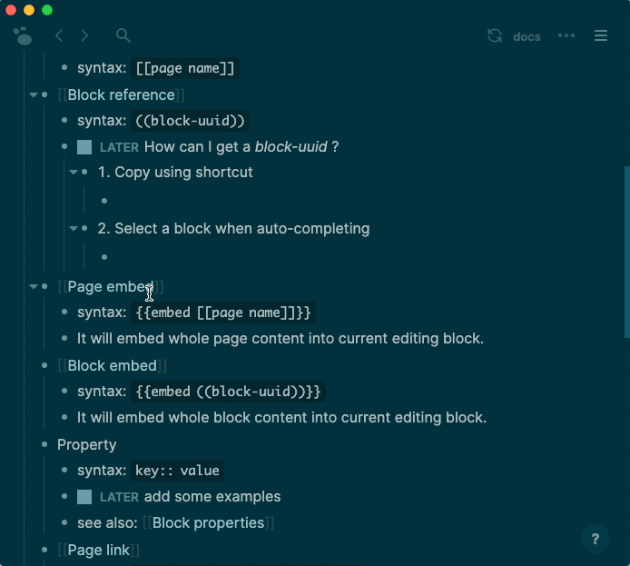
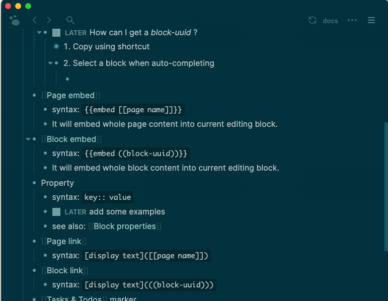

- Logseq support most [[Markdown]] syntaxes, and includes some extended syntaxes.
### **Standard** syntax
  - `**Bold**`   -> **Bold**
  - `_Italics_ ` -> _Italics_
  - `~~Strikethrough~~` -> ~~Strikethrough~~
  - `^^Highlight^^` -> ^^Highlight^^
  -
    [:div [:code  "`Code`"]  "-> " [:code "Code"]]
  - `[label](https://example.com)` -> [label](https://example.com)
  - `` -> {:height 53, :width 42}
  - and so on...
### **Extended** syntax
id:: 60a78b6b-a0ff-49fe-822f-87216fbf79ff
  - [[Page reference]]
    - syntax: `[[page name]]`
      id:: 60a78b6b-688c-4ced-9104-60784597daf9
  - [[Block reference]]
    - syntax: `((block-uuid))`
    - How can I get a _block-uuid_ ?
      done:: 1621594005775
      now:: 1621585437721
      later:: 1621585438918
      id:: 60a78b6b-b74f-4496-a7b7-dc0d454ca4f3
      collapsed:: true
      -
        1. Copy a block-reference using shortcut
        - {:height 354, :width 437}
          id:: 60a78e09-8840-43ad-9292-a483841da5f6
      -
        2. Select a block when auto-completing
        - {:height 352, :width 442}
  - [[Page embed]]
    - syntax: `{{embed [[page name]]}}`
    - It will embed whole page content into current editing block.
      id:: 60a78b6b-b43d-4328-a1dc-934f0d3dbff7
  - [[Block embed]]
    - syntax: `{{embed ((block-uuid))}}`
    - It will embed whole block content into current editing block.
      id:: 60a78b6b-70c6-4209-bb26-045395458a04
  - Property
    - syntax: `key:: value`
      - some examples
        - [[Templates]] related properties
          collapsed:: true
          -
            [:code "template:: template-name"]
          -
            [:code "including-parent:: false"]
          - {{embed ((60a790f8-d187-499a-b2e2-73bf137356dd))}}
    - see also: [[Block properties]]
  - [[Page link]]
    - syntax: `[display text]([[page name]])`
  - [[Block link]]
    - syntax: `[display text](((block-uuid)))`
  - [[Tasks & Todos]] marker
    - syntax: `TODO` `DOING` `DONE` `LATER` `NOW`
    - These markers can be set with commands(`/TODO`) 
      or shortcut(default `cmd+enter`)
  - priority
    - syntax: `[#A]` `[#B]` `[#C]`
  - [[Hiccup]]
    - Sometimes you want to express more complex text structure, you can embed Hiccup in blocks.
    - example
      - `[:p "Hello " [:em "World!"]]`
        ->[:p "Hello " [:em "World!"]]
    - [Hiccup syntax here](https://github.com/weavejester/hiccup/wiki/Syntax)
  - inline latex
    - `$$E = mc^2$$` -> $$E = mc^2$$
