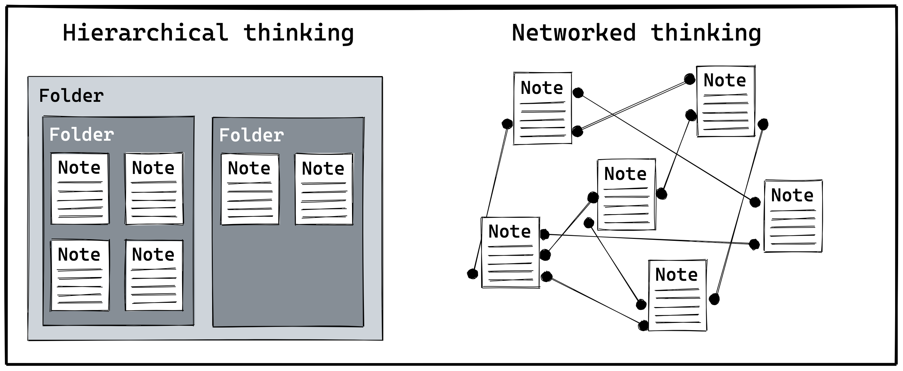

- ## Introduction
	- Logseq looks simple on the surface and is extremely powerful under the hood. Much like the famed Microsoft Excel, Logseq aims to be an environment for thinking. Excel's fuel are blocks of numbers, Logseq's fuel are blocks of words.
	- It takes time to master this tool, as Logseq doesn't impose a way of working. But once you figure out how to get your desired end results, Logseq will help you become a much more effective note-taker—and even a more effective thinker.
	- To help you get started figuring out the workflows that work for you,  we will take you through all of Logseq's core features. See them as tools in your toolbox; individually a tool will do little, but once you learn to use them in combination you can become an artist. Aim to be a knowledge artist.
	- Before we dive into the overview of Logseq's functionality, let's first dig a bit deeper into what makes Logseq special. As we said before; Logseq looks simple on the surface. But looks can be deceptive.
- ## What makes Logseq special?
	- If you went ahead and already installed Logseq, you might have noticed that you landed on a page with today's date and a single dot—or bullet. Hm... looks a lot like the beginning of an outline, doesn't it?
	- That's right: Logseq is an outliner. And that's a crucial fact.
	- Each bullet denotes a block, and it's the fundamental unit of information in Logseq. Everything in Logseq is about the block, and throughout this guide we'll see what are the implications and opportunities of this concept.
	- But why is this block thing important? Isn't it enough to have pages in folders? After all, note-taking apps and word processors have had them for decades, so pages must be the fundamental unit of knowledge work. Right?
	- Well... no.
	- While pages are great for linear writing, the way our brains work is far from linear. When thinking of one thing, we can easily name a handful related ideas. And while our brains are great at associating ideas, it's notoriously bad at juggling more than a handful at the same time.
	- In other words: we have fast working memory, but its capacity is limited.
	- To expand our working memory we tend to use all types of note-taking devices, pen and paper included. But even though note-taking apps have made it much easier to take notes, organize them, and retrieve them, they're still overwhelmingly linear pieces of writing. For most of us, our brains just don't work that way.
- ## The philosophy of Logseq
	- Common note-taking tools like Evernote, Notion, and Apple Notes are hierarchical, meaning that your notes live within folders. Each note is always in exactly one folder.
	- Some apps add a dimension called nesting, which happens when you indent paragraphs or notes underneath others. That way, a note can live in another note, which in turn can live in another note, _ad infinitum_.
	- Logseq is different in that notes have no fixed location. The atomic unit of knowledge in Logseq isn’t a page; it’s a block. While under the hood Logseq will save your blocks in Markdown files (more on that later), each block is free to be used wherever. That means you can easily connect to any other block in the same database.
	- Imagine blocks being cities, which are connected by roads (links).
	- 
	- In the coming lessons we’ll dive deep into what this freedom of information enables us to do. For now it’s enough to understand that every bullet is a block and that it can connect to any other block or collection of blocks (pages) in the same database.
	- [>> Continue by creating a new Logseq graph ]([[How to create a new graph]])
	- [>> Continue by creating a Logseq graph using existing Markdown files]([[How to create a Logseq graph using existing Markdown files]])