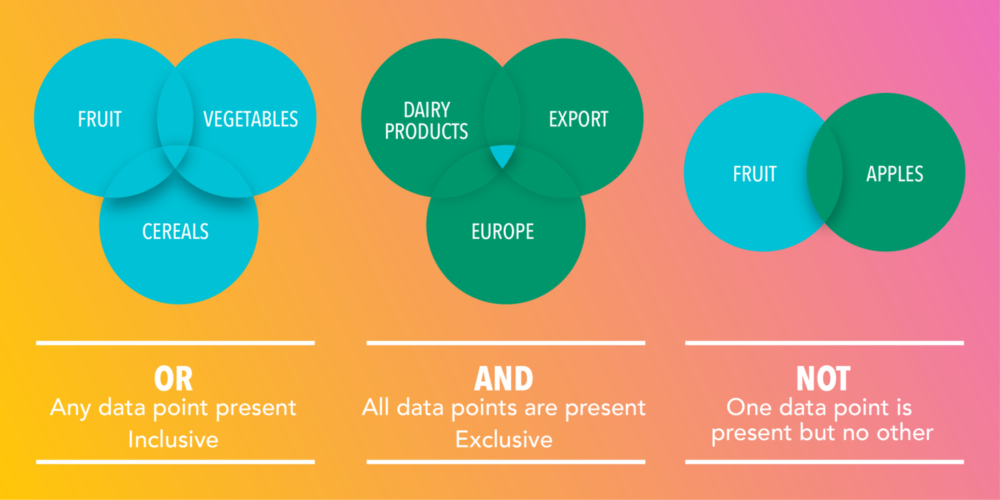

title:: WIP Supercharge search with queries

- ## Introduction
	- The easiest way to search your Logseq graph is by using the search bar at the top (shortcut: `Cmd-k` on macOS and `Ctrl-k` on Windows/Linux). Then, using filters you can refine what's visible on the page.
	- But what if you want to see results from several pages or want to be very precise about what you're searching for? That's when you need queries.
	- In this lesson, we'll first dive into boolean logic before digging into how to use it in queries. Queries are one of the most complex things in Logseq, but don't you worry; once you understand boolean logic, writing queries will be a breeze.
- ## Queries are like a saved search
	- Why would you go through the trouble of writing queries when you can search and filter? First, queries allow for much more precise searching. Second, queries are like a saved search.
	- Every time a block meets the requirements to be included in a query, it automatically appears in the query results. That's the reason many Logseq users write queries to handle their TODO lists or use it to build pipelines based on statuses.
- ## Boolean logic and query operators
	- A good start is to first make sure you understand boolean logic. If you're already familiar with programming logic, you can skip this section (although a refresher is never a bad thing).
	- Boolean logic is a basic form of algebra that fully functions with three so-called _operators_: **and**, **or**, **not**. Each operator is used in combination with one or more _arguments_, which are values that are searched for. When using these operators and arguments in a _statement_ (a search formula), only one of two results are possible: True or False.
	- It's best to explain this using a visual (blue = True, green = False):
		- 
		  _Source: [What is Boolean Logic?](https://www.lotame.com/what-is-boolean-logic) by Lotame_
	- In Logseq queries, only the blocks that return the result True are shown. By using the operators in combination, you can come to very precise search results. But, to keep things simple, we'll only focus on the basics now.
	- Let's have a look at how the three operators are used in Logseq.
- ## How to create queries in Logseq
	-