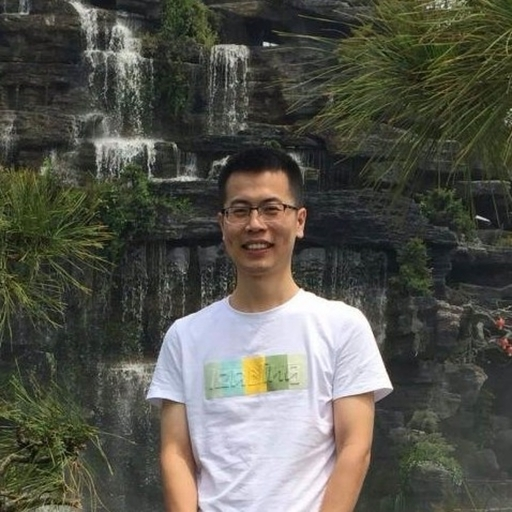
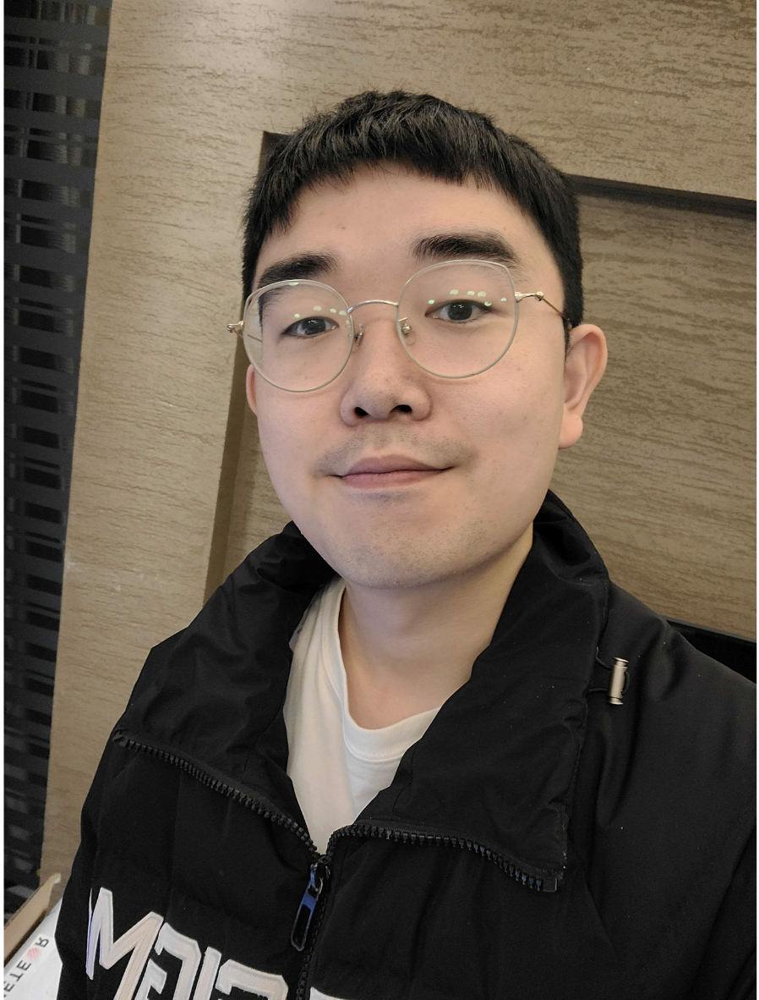

## **Hello, everyone!**
## **A little about the team**
### **Michael** 

### **Charlie**  
### **Zhiyuan**

### **Weihua**

### **Junyu** 
{:height 379, :width 279}
### I'm Tienson from Hangzhou, thanks to my wife we have a beautiful daughter.
#### {:height 557, :width 518}
## **What's logseq?**
### At present, it's a note-taking app
#### It's also a community for knowledge sharing and collaboration, yes, our discord group and forum!
### In the future, we hope Logseq can be more helpful for young students around the world.
## **Why the name?**
:PROPERTIES:
:later: 1616236181947
:END:
I know `log` is for daily notes, what `seq` means?
### It's a sequence of our notes, ideas and thoughts. To me it's all the things I want to remember in my life.
## **Why building logseq?**
### I started a side project called `putchar.org` back in 2018, which is Medium for programmers, a place to publish and discuss tech articles.
#### Unfortunately, it's deprecated after more than 1 year working on it because for me It's hard to build a community and I have some contracts at that time so that I can't focus on it.
#### But I still want to make it better for general knowledge publishing and collaboration.
#### Also, many code, especially the parser for logseq are from some of my previous side projects, so failures are not that bad :)
### I was using both Org-mode and TiddlyWiki for my notes, I want to read my notes and capture some links on mobile, also, I want a better outliner UI on web  compared to text editors like Emacs and Vim.
### So, when my last contract ended at the end of 2020, I knew it's the time to build something! 😎
## **What's the difference between logseq and other tools?**
### **The user is the king of the data. ** [[local-first]]
Simply put, I don't trust putting my notes and my life on any cloud services without End-to-End encryption support.
### **Logseq doesn't lock the data.**
#### Even though logseq is an outliner tool, it works directly with plain-text like Markdown and Org mode. We believe in plain-text for data longevity, we believe in standard syntaxes and open protocols for better collaboration with the existing ecosystem.
#### Shameless plug, logseq might be the **_first_** app that have two-way sync between plain-text and outliner, yay!
### **Everyone can build their own workflows**
Slip box? GTD? Hierarchical tags? With [[Queries]], [[Advanced Queries]] and coming [[Plugins]], nothing is impossible!
### **Open Source**
As developers, we believe the ultimate fun is to fork the code and do nasty tweaks!
### **Being different instead of a clone**
#### Bring org mode's task management and many other features to Markdown
#### The first(might be) note-taking app with Git sync on Web (Thanks to [[Isomorphic-git]])
#### The first(might be) note-taking app can work with your local files on Web
#### ` /Page Embed`
#### `/Draw` integration with [[Excalidraw]]
#### `Now Later workflow`
#### Custom queries on journals page
#### Publishing the whole web app to your own website
## **The future**
### More stable and more performant
### Better undo/redo #undotree
### End-to-End encryption storage
### Mobile apps
### Real-time collaboration
### Exploring more ways to help for thoughts
### Who knows?
## **Thank you everyone for your time, have a great weekend!** 🙏
